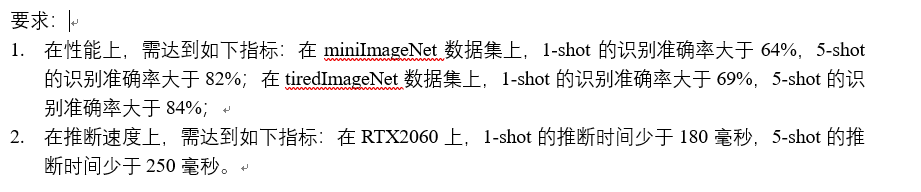

# FewShotProject
## 1. Dataset

## dim196
64.58+-0.43(C=0.1)

### born1
66.68+-0.43(C=0.1) 304.96ms

66.73+-0.43(C=0.1) 304ms

66.58(C=1)

66.75(C=2 saga)

66.81(C=2)

83.32+-0.28(C=2) 454.24ms

### born2
66.40+-0.44(C=0.1) 297.81ms

82.57+-0.29(C=2) 434.42ms

### born 3
66.03+-0.43 (C=0.1) 286ms

## dim128
### born1
66.23+-0.44 (C=2)

65.72+-0.44 (C=1)
### born2
66.04+-0.44(C=2)

## 640 sm0.2 last

66.88 

83.96

### born1
66.86 

## dim 640
### 640 born1
84.74+-0.28

67.53+-0.43
### 640 born2

84.56+-0.29

67.60+-0.43
### born3
84.22+-29

## 640 sm0.2 vs 640 vs 640 sm+ra
66.88 66.28 66.23

83.96 84.32